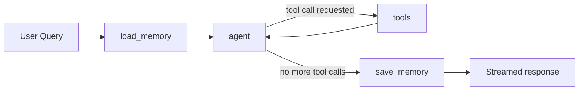

# Josh AI 🎓

An AI-powered conversational assistant for **JoSAA counselling** — helping JEE Advanced/Main aspirants get rank-based college predictions, placement data, and counselling-rule answers from real seat-allocation data instead of LLM guesswork.

Built by **Parth Pawar**, **Shiva Dubey**, and **Mayank Khoria** at Cynaptics Club, IIT Indore.

---

## Overview

Every year, lakhs of JEE aspirants sift through cutoff PDFs, counselling brochures, and forums trying to figure out which college and branch they can realistically get into. Josh AI answers that directly: give it a rank, category, and gender, and it looks up actual JoSAA seat allocation records and placement stats to give a grounded answer — with a system prompt and tool-only data policy specifically designed to stop the LLM from inventing ranks or colleges.

## Features

- **Rank-based predictions** for JEE Advanced (IITs) and JEE Main (NITs/IIITs), pulled from official JoSAA seat allocation data
- **Institute-wise lookup** — all branches and cutoffs for a specific IIT
- **Placement statistics** from a dedicated database table
- **JoSAA rules search** via RAG over a Qdrant vector store
- **Persistent memory** for registered users (rolling summary + short-term window), in-memory sessions for guests
- **Streaming responses** over FastAPI
- **Multi-key Groq LLM pool** with round-robin rotation to spread out rate limits
- **Anti-hallucination guardrails** — the agent is only allowed to answer from tool output, and allocation results must render as a fixed-format markdown table

## Architecture

The backend is a [LangGraph](https://github.com/langchain-ai/langgraph) `StateGraph` wrapped in a FastAPI app:



- **load_memory** — builds the system prompt, injecting the registered user's profile (rank, category, gender) if available, or instructing the model to extract it from conversation for guest users. Also loads the rolling summary and recent turns.
- **agent** — sends the conversation to a pooled Groq LLM (`ChatGroq`, bound to 5 tools), cycling across API keys via `APIKeyRotator`.
- **tools** — executes whatever tool calls the model requested, async.
- **save_memory** — appends the exchange to short-term memory, summarizes and trims once it exceeds 12 messages, and persists to Postgres for registered users (or an in-memory dict for guests).

### Tools available to the agent

| Tool | Purpose |
|---|---|
| `retrieve_college_allocations_JEE_Adv` | Rank/category/gender → matching IIT allocations |
| `retrieve_college_allocations_JEE_Main` | Rank/category/gender → matching NIT/IIIT allocations |
| `retrieve_college_allocations_institutewise` | All branch-wise cutoffs for one named institute |
| `placement_data` | Placement stats for a given institute |
| `search_jossa` | Semantic search over JoSAA rules (Qdrant-backed RAG) |

Live web search and image search (via Serper) were also built and working at one point, but were dropped — they couldn't be held to the same strict, tool-only anti-hallucination guardrails as the rest of the system, so the assistant is scoped to data it can verify from the local DB and vector store.

### Guardrails

The system prompt restricts the assistant to JEE/JoSAA/placements/rules topics, forbids answering from the model's own knowledge, and forces allocation results into a fixed markdown table format (`| Institute | Academic Program | Opening Rank | Closing Rank | Allotted On |`) so nothing gets silently summarized or dropped.

## Tech Stack

- **Backend:** FastAPI (async), Python 3.11
- **Agent orchestration:** LangGraph, LangChain
- **LLM:** Groq (`openai/gpt-oss-120b`)
- **Database:** PostgreSQL via `asyncpg` (Azure Flexible Server)
- **Vector store:** Qdrant Cloud (JoSAA rules RAG)
- **Deployment:** Docker, Azure Container Apps, Azure Container Registry

## Repository Structure

```
.
├── Agent.py                # FastAPI app + LangGraph orchestrator + tool definitions (entrypoint)
├── Asyncrulesretriever.py  # Semantic search over JoSAA rules (RAG)
├── qdrant.py                # Uploads JoSAA rule documents into Qdrant
├── Postgres/                # DB access layer — allocation & placement retrievers, user CRUD
├── Docs/                    # Source data: seat allocation JSON, placement data, rules, reports
└── .gitignore
```

## Data

All seat-allocation and rules data lives in `Docs/` as JSON, sourced from official JoSAA records and cleaned/normalized (rank types, quotas, category codes) before being loaded into Postgres and Qdrant:

| File | Records | Description |
|---|---|---|
| `2025_iit_cutoffs.json` | ~3,100 | IIT seat allocations (JEE Advanced) |
| `nit_orcr.json` + `iiit_josaa_ranks_2025.json` | ~4,400 | NIT/IIIT seat allocations (JEE Main) |
| `rules.json` | — | JoSAA counselling rules, chunked for RAG |
| `Jee_adv_2025_report.pdf` | — | Source report for JEE Advanced data |

## API

### `POST /chat`
Streams the assistant's response as `text/plain`. Tool calls are yielded inline as `||TOOL_CALL:<name>||` markers before the tool's output is fed back into the model's next tokens.

Body:
```json
{
  "query": "What are my chances at IIT Bombay CSE?",
  "email": "optional — omit or set skip_registration=true for guest mode",
  "session_id": "default_session",
  "adv_rank": 1500,
  "category": "OPEN",
  "gender": "Male"
}
```

### `POST /check-user`
```json
{ "email": "user@example.com" }
```
Returns `{ "exists": true | false }`.

## Setup

### Prerequisites
- Python 3.11
- A PostgreSQL instance (local or Azure Flexible Server)
- A Qdrant instance (cloud or self-hosted)
- One or more Groq API keys

### Environment variables

```
GROQ_API_KEY=key1,key2,key3   # comma-separated — rotated round-robin across requests
```

Postgres and Qdrant connection details are read inside `Postgres/orcr_retriever.py`, `Postgres/user_crud_asyncpg.py`, and `qdrant.py` respectively — check those files for the exact variable names they expect before deploying.

### One-time data ingestion
1. Load the seat-allocation and placement JSON files from `Docs/` into Postgres (see `Postgres/postgres_orcr_data.py` for the cleaning logic, or restore directly from `orcr_data_complete.sql`).
2. Run `python qdrant.py` to embed and upload `rules.json` into Qdrant.

## Deployment

Containerized with Docker and deployed as an Azure Container App, backed by an Azure PostgreSQL Flexible Server and Qdrant Cloud for vector search.

```bash
docker build -t josh-ai-backend .
docker tag josh-ai-backend <registry>.azurecr.io/josh-ai-backend:vX
docker push <registry>.azurecr.io/josh-ai-backend:vX
az containerapp update --name josh-ai-backend --image <registry>.azurecr.io/josh-ai-backend:vX
```

## Roadmap

- Re-enable live web search for out-of-scope but still relevant queries (rankings, general institute info) — with tighter guardrails this time
- Cutoff trend analytics and branch comparisons

## Team

Built by [Parth Pawar](https://www.linkedin.com/), [Shiva Dubey](https://www.linkedin.com/in/shiva-dubey-b90b36370/), and Mayank Khoria — AI/ML enthusiasts at [Cynaptics Club, IIT Indore](https://www.linkedin.com/company/cynaptics-club-iit-indore/). With mentorship from Yash Bhamare and Satyam Ashtikar.

## License

Not yet decided
